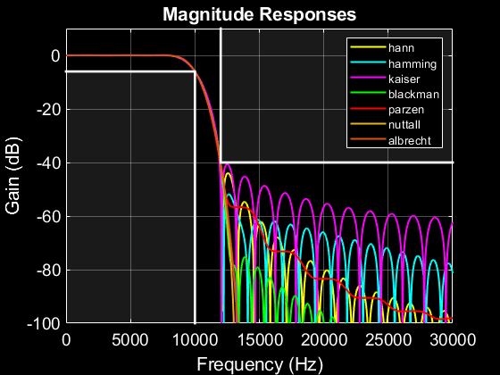
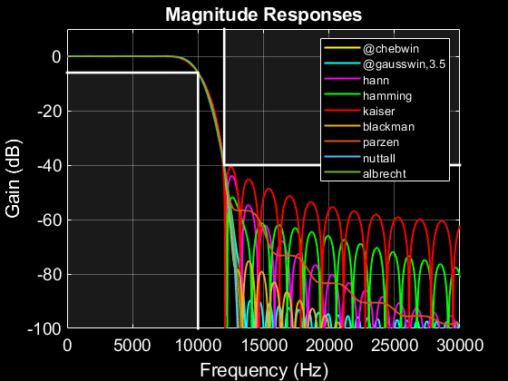
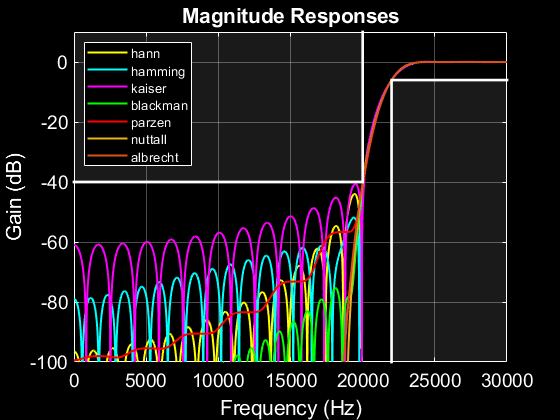
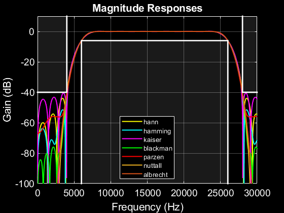
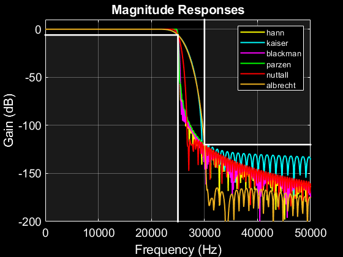

## wsinc

If you Google "Windowed Sinc Filter" you'll get page after page of papers, tutorials, and tools. Sadly none will offer side by side comparisons of filters designed using different windows all to a common spec. Until now.

COMPARE_FILTERS takes a user-supplied filter spec and designs a set of windowed sinc FIR filters using several common window types. It then compares the resulting filters in terms of complexity (number of coefficients), passband flatness, and stopband rejection. This helps you make an informed choice in selecting an implementation best suited to your application.

The tool designs lowpass, highpass, and bandpass filters with the following built-in windows: Hann, Hamming, Kaiser, Blackman, Parzen, Nuttall (4-term), and Albrecht (6-term).

Optionally it can accept one or more user-supplied windows as a list (cell array) of function handles referencing functions that use the MATLAB or GNU Octave window function API. That is, the tool accepts handles to functions that take a first argument containing the window length and an optional second argument to specify a window shaping parameter. Examples of such functions include bartlett(L) and chebwin(L,r). This feature makes it possible to create your own window function for evaluation.

The tool runs an iterative search algorithm to determine the minimum number of filter coefficients needed to satisfy the design specifications. A table of results is then displayed, one row per window type, allowing you to compare different filter implementations.

COMPARE_FILTERS is compatible with both MATLAB and GNU Octave. It is implemented so as not to require any MATLAB toolboxes or GNU Octave packages. However it will likely run faster if the Signal Processing toolbox/package is installed.

## Inputs

* **fc** cutoff frequency spec in Hz, the frequency at which the normalized magnitude response is -6 dB. For lowpass and highpass filters specify a single frequency. For bandpass filters specify a vector of two frequencies corresponding to the lower and upper passband edges.

* **fstop** stopband frequency spec in Hz, the frequency at which the normalized magnitude response is down Adb db or more. For lowpass and highpass filters specify a single frequency. For bandpass filters specify a vector of two frequencies corresponding to the lower and upper stopband edges.

* **fs** sampling frequency Hz
* **Adb** stopband attenuation spec in dB

### Optional inputs

* **filter_type** optional char array, one of 'lowpass','highpass',or 'bandpass' (default 'lowpass')

* **user_win_c** optional cell array of function handles to window function. For example {'@tukeywin','gausswin,3.5'} adds comparisons for a Tukey window and a Gaussian window with shaping factor of 3.5. As shown in the example, if the window function uses a shaping factor it is included in the cell after the window name, separated by a comma.

## Outputs

* **results_c** cell array containing windowed sinc design and performance measurements. Each cell contains a struct with the following members
   - **type** filter type, one of 'lowpass', 'highpass', or 'bandpass'
   - **window** name of window
   - **window_param** window shaping parameter
   - **ntaps** number of filter coefficients
   - **fc** 6dB cutoff frequency design spec (Hz)
   - **fstop** stopband frequency design spec (Hz)
   - **fs** sampling frequency design spec (Hz)
   - **Adb** stopband attenuation design spec (dB)
   - **pt1db** measured passband 0.1 dB frequency (Hz)
   - **onedb** measured passband 1 dB frequency (Hz)
   - **threedb** measured passband 3 dB frequency (Hz)
   - **Psbdb** measured average stopband attenuation (dB)
   - **cofs** 1-d array of filter coefficients
   - **wcofs** 1-d array of window coefficients
   - **Hdb** 1-d array of magnitude reponses (dB)
   - **f** 1-d array of frequencies (Hz)

Upon completion, a table containng a textual summary of results is displayed with the following columns

* **Window**       Name of window including shaping factor, if applicable
* **Ntaps**        Number of filter coefficients
* **Fc**             Cutoff frequency spec (Hz); In bandpass designs, two columns are displayed, Fc1 and Fc2, respectively the lower and upper cutoff frequencies
* **Fstop**          Stopband frequency spec (Hz); In bandpass designs, two columns are displayed, Fstop1 and Fstop2, the lower and upper stopband frequencies
* **Fs**             Sampling frequency spec (Hz)
* **Adb**            Stopband attenuation spec (dB)
* **F.1db**          Frequency (Hz) at which the response is -0.1 dB (measure of passband flatness); In bandpass designs this column displays as BW.1db, the 0.1 dB bandwidth
* F1db**           Frequency (Hz) at which the response is -1 dB (measure of passband flatness); In bandpass designs this column displays as BW1db, the 1 dB bandwidth
* **F3db**           Frequency (Hz) at which the response is -3 dB (measure of passband flatness); In bandpass designs this column displays as BW3db, the 3 dB bandwidth
* **Psbdb**          Average stopband attenuation (measure of spectral purity)

## Examples

### Example 1: Compare performance of several windowed filters designed to a specification
* Cutoff frequency:   10 kHz
* Stopband frequency:   12 kHz
* Sampling frequency:   64 kHz
* Stopband attenuation:   40 dB

```
>> res = compare_filters(10e3,12e3,64e3,40)
```

| Window           | Ntaps     |    Fc  |   Fstop |      Fs |  Adb |  F.1db |   F1db |   F3db | Psbdb |
| ---------------- | --------- | ------ | ------- | ------- | ---- | ------ | ------ | ------ | ----- |
| hann             |   51      |  10000 |  12000  |  64000  |  40  |  8085  |  8800  |  9446  |  -59  |
| hamming          |   51      |  10000 |  12000  |  64000  |  40  |  8111  |  8878  |  9487  |  -64  |
| kaiser(3.4)      |   39      |  10000 |  12000  |  64000  |  40  |  8148  |  8803  |  9440  |  -53  |
| blackman         |   67      |  10000 |  12000  |  64000  |  40  |  8077  |  8891  |  9498  |  -64  |
| parzen           |   77      |  10000 |  12000  |  64000  |  40  |  8088  |  8928  |  9518  |  -61  |
| nuttall          |   81      |  10000 |  12000  |  64000  |  40  |  8061  |  8904  |  9507  |  -63  |
| albrecht         |   99      |  10000 |  12000  |  64000  |  40  |  8049  |  8915  |  9514  |  -62  |

The results show that a filter designed with a Kaiser window with beta=3.4 satisfies the spec with the fewest coefficients. Hamming and Blackman windowed designs provide the most stopband attenuation (at the expense of more coefficients) while the Parzen window yields the flatest passband.

You can plot results using the included plotres() utility.
```
>> plotres(res);
```

 
### Example 2: Supply your own window functions
This example adds Chebychev and Gaussian (shape factor=3.5) windows.  The Gaussian design provides the flatest 3dB bandwidth while the Chebychev window proivdes no improvement in complexity, passband or stopband responses compared to the built-in windows.
```
>> res = compare_filters(10e3,12e3,64e3,40,{'@chebwin','@gausswin,3.5'});
```
| Window           |  Ntaps   |    Fc  |  Fstop   |     Fs  |  Adb   |  F.1db   |   F1db  |    F3db  |  Psbdb |
| ---------------- | -------- | ------ | ------   | ------- | ------ | -------  |  -----  | -------  | ------ |
| @chebwin         |     77   | 10000  |  12000   |  64000  |   40   |   8058   |   8904  |    9507  |    -63 |
| @gausswin(3.5)   |     85   | 10000  |  12000   |  64000  |   40   |   8068   |   8953  |    9535  |    -62 |
| hann             |     51   | 10000  |  12000   |  64000  |   40   |   8085   |   8800  |    9446  |    -59 |
| hamming          |     51   | 10000  |  12000   |  64000  |   40   |   8111   |   8878  |    9487  |    -64 |
| kaiser(3.4)      |     39   | 10000  |  12000   |  64000  |   40   |   8148   |   8803  |    9440  |    -53 |
| blackman         |     67   | 10000  |  12000   |  64000  |   40   |   8077   |   8891  |    9498  |    -64 |
| parzen           |     77   | 10000  |  12000   |  64000  |   40   |   8088   |   8928  |    9518  |    -61 |
| nuttall          |     81   | 10000  |  12000   |  64000  |   40   |   8061   |   8904  |    9507  |    -63 |
| albrecht         |     99   | 10000  |  12000   |  64000  |   40   |   8049   |   8915  |    9514  |    -62 |
```
>> plotres(res);
```

 
### Example 3: You can bypass analysis of built-in windows by setting the last user window in the list to 'break'.
```
 >> res = compare_filters(10e3,12e3,64e3,40,{'@flattopwin','break'});
```
| Window           | Ntaps   |    Fc   | Fstop    |    Fs   | Adb   | F.1db    | F1db    | F3db  | Psbdb |
| ---------------- | ------- | ------- | -------  | ------- | ----- | -------  | ------- | ----- | ----- |
| @flattopwin      |   105   | 10000   | 12000    | 64000   |  40   |  8033    | 8782    | 9403  |   -63 |

### Example 4: Highpass filter design
```
 >> res = compare_filters(22e3,20e3,64e3,40,'highpass');
```
| Window           | Ntaps   |    Fc   | Fstop    |    Fs   | Adb   | F.1db    | F1db    | F3db  | Psbdb |
| ---------------- | ------- | ------- | -------  | ------- | ----- | -------  | ------- | ----- | ----- |
| hann             |    51   | 22000   |   20000  |  64000  |  40   |  23915   |  23200  | 22554 |   -59 |
| hamming          |    51   | 22000   |   20000  |  64000  |  40   |  23889   |  23122  | 22513 |   -64 |
| kaiser(3.4)      |    39   | 22000   |   20000  |  64000  |  40   |  23852   |  23197  | 22560 |   -53 |
| blackman         |    67   | 22000   |   20000  |  64000  |  40   |  23923   |  23109  | 22502 |   -64 |
| parzen           |    77   | 22000   |   20000  |  64000  |  40   |  23912   |  23072  | 22482 |   -61 |
| nuttall          |    81   | 22000   |   20000  |  64000  |  40   |  23939   |  23096  | 22493 |   -63 |
| albrecht         |    99   | 22000   |   20000  |  64000  |  40   |  23951   |  23085  | 22486 |   -62 |

```
plotres(res);
```


### Example 5: Bandpass filter design
```
 >> res = compare_filters([6e3 26e3],[4e3 28e3],64e3,40,'bandpass');
```
| Window      | Ntaps   |  Fc1    |     Fc2  | Fstop1  | Fstop2|     Fs  |  Adb  | BW.1db |  BW1db |  BW3db | Psbdb |
| ----------- | ------- | ------- | -------  | ------- | ----- | ------  | ----- | ------ | ------ |  ----- | ----- |
| @hamming    |    51   |  6000   |  26000   |   4000  | 28000 |  64000  |   40  | 16222  |  17756 |  18974 |   -64 |
| hann        |    51   |  6000   |  26000   |   4000  | 28000 |  64000  |   40  | 16170  |  17600 |  18892 |   -59 |
| hamming     |    51   |  6000   |  26000   |   4000  | 28000 |  64000  |   40  | 16222  |  17756 |  18974 |   -64 |
| kaiser(3.4) |    39   |  6000   |  26000   |   4000  | 28000 |  64000  |   40  | 16296  |  17606 |  18880 |   -53 |
| blackman    |    67   |  6000   |  26000   |   4000  | 28000 |  64000  |   40  | 16154  |  17782 |  18996 |   -64 |
| parzen      |    77   |  6000   |  26000   |   4000  | 28000 |  64000  |   40  | 16176  |  17856 |  19036 |   -61 |
| nuttall     |    81   |  6000   |  26000   |   4000  | 28000 |  64000  |   40  | 16122  |  17808 |  19014 |   -63 |
| albrecht    |    99   |  6000   |  26000   |   4000  | 28000 |  64000  |   40  | 16098  |  17830 |  19028 |   -62 |

```
plotres(res);
```


### Example 6: This final example illustrates how differences between windows become magnified when the filter spec is tight. Here we have a channelizer requirement for a comms system with 128 channels evenly spaced by 50 kHz over a 6.4 MHz band. The specification calls for 120 dB stoband attenuation and a very narrow transition bandwidth.
* Cutoff frequency:   25 kHz
* Stopband frequency:   30 kHz
* Sampling frequency:   6.4 MHz
* Stopband attenuation:  120 dB

```
>> res = compare_filters(25e3,30e3,6.4e6,120);
```
| Window           |  Ntaps   |    Fc  | Fstop    |    Fs   | Adb    | F.1db   | F1db   | F3db    | Psbdb  |
| ---------------- | -------- | ------ | ------   | ------- | ------ | ------- |  ----- | ------- | ------ |
| hann             |  46261   | 25000  |  30000   | 6400000 |   120  |  24792  | 24866  | 24939   |  -157  |
| kaiser(12.3)     |   5513   | 25000  |  30000   | 6400000 |   120  |  22180  | 23401  | 24280   |  -150  |
| blackman         |  33353   | 25000  |  30000   | 6400000 |   120  |  24609  | 24780  | 24890   |  -158  |
| parzen           |  63849   | 25000  |  30000   | 6400000 |   120  |  24768  | 24866  | 24939   |  -155  |
| nuttall          |  14263   | 25000  |  30000   | 6400000 |   120  |  23901  | 24377  | 24719   |  -156  |
| albrecht         |   6941   | 25000  |  30000   | 6400000 |   120  |  22241  | 23462  | 24304   |  -167  |

Notice the order of magnitude plus increase in complexity of the Parzen design compared to Kaiser, a steep price for a mere 5 dB additional rejection and modest improvement in passband flatness. A better trade may be the Albrecht design which provides 17 dB better stopband for a 26% increase in complexity compared to Kaiser.

```
plotres(res);
```


## References
1. F.J. Harris, "Multirate Signal Processing for Communications Systems," Prentice Hall, 2004.
2. Nuttall, Albert H., "Some windows with very good sidelobe behavior" IEEE Transa on Acoustics, Speech, and Signal Processing Vol. ASSP-29, February 1981, pp. 84-91.
3. Albrecht, Hans H., "A family of cosine-sum windows for high- resolution measurements". 2001 IEEE International Conference on Acoustics, Speech, and Signal Processing, July 2001.

